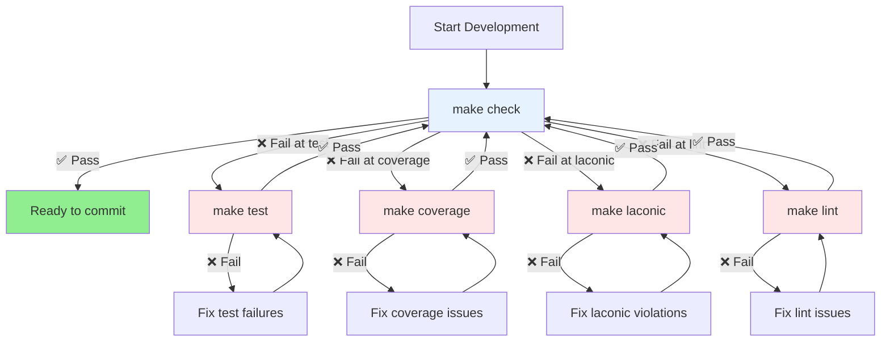

# Claude

## Development Workflow

**The Quality Engine:**

This workflow operates like a precision engine with interlocking gears - each quality gate is a gear that must spin smoothly for the engine to run:

- **Main crankshaft**: `make check` - drives development forward when all gears mesh
- **Test gear**: Ensures functionality works (must pass to spin)
- **Coverage gear**: Ensures everything is tested (must reach 100% to spin)  
- **Laconic gear**: Ensures code stays maintainable (functions <15 lines to spin)
- **Lint gear**: Ensures code style consistency (zero warnings to spin)

When one gear jams (a quality gate fails), the entire engine stops. The workflow becomes:

1. **Diagnose which gear is stuck** (read the failure output from `make check`)
2. **Service that specific gear** (fix issues, run individual `make` commands)
3. **Spin until smooth** (iterate until that gear returns exit code 0)
4. **Restart the engine** (run `make check` to engage all gears)

All gears must mesh perfectly for the engine to produce its output: **code ready to commit**.

**Strict Requirements:**
1. `make test` must pass
2. `make coverage` must pass (no `make test` regressions)
3. `make laconic` must pass (no `make test` or `make coverage` regressions)  
4. `make lint` must pass (no `make test`, `make coverage`, or `make laconic` regressions)

## Coding Standards

- Functional programming style preferred
    - under 3 lines of code mean a function may be overkill
        - investigate list comprehensions and lambdas.
    - under 5 lines is a good sign.
    - 5-10 lines ok OK.
    - 10-15 lines is a warning sign.
    - over 15 lines is a no-go.
    - functions should be logically grouped into single-file modules.
        - under 100 lines of code is a good sign.
        - 100 lines of code is a warning sign.
        - over 150 lines of code is a no-go.
    - classes are ok to use, but only if:
        - we need to maintain more than a few variable's worth of state
        - we need to tie state to data, so we can have cleaner syntax for things like `car.turn()`
        - each class is stored it's own file
            - only one class per file
            - the filename is the class name in snake case.
        - you observe the single responsibility principle for any classes.
        - you observe the principle of least suprise for any design decisions.
        - you favor composition over inheritance for your class design.
            - this does not necessarily mean a functional approach, although that is appreciated
            - if we have state or want to have some kind of inhertance to keep code dry, then
              you are required to use a composition-based class approach.
        - you do not write classes that are longer than 150 lines of actual code.
            - under 100 lines of code is a good sign.
            - 100 lines of code is a warning sign.
            - over 150 lines of code is a no-go.
- you use meaningful english words for function names, class names, variable names, etc. these types tell a story.
- you do not add any features or capabilities without my explicit instruction to do so.
    - less is more.
- When it comes to naming conventions, specific names, etc. we need to be very consistent with the terminolgy used in the documentation directory.
- Follow the "zeroing in" naming pattern where filenames and class names move from general to specific as you read left to right (e.g., domain_component_specific_entity.py).
- **Minimize cognitive load through semantic vector distance:**
    - Code should minimize semantic vector distance between domain expert language and implementation
    - "Calculate the time in my timesheet" → `timesheet.calculate()` is much closer than `calculate_total_minutes(timesheet)`
    - Function signatures should cluster tightly in vector space using consistent linguistic patterns
    - Architecture should follow natural thought units that domain experts use, not arbitrary programming abstractions
    - Lower cognitive load makes everyone more efficient - less mental translation between domain thinking and code
    - The data model should form a directed acyclic graph (DAG) that mirrors how information flows in the domain
    - **Start with natural language, stay close to it:**
        - Before creating any new module/service, ask: "How would a domain expert naturally express this?"
        - "Summarize my timesheets" → `timesheets.summary()`, not `summary_calculator.calculate(timesheets)`
        - "Calculate my timesheet total" → `timesheet.calculate_total()`, not `calculator.total_minutes(timesheet)`
        - Operations on domain objects should live on those objects, not in separate utility services
        - If you're creating a "calculator" or "processor" or "handler", question whether it belongs on the domain object instead
    - **Domain as a DAG (Directed Acyclic Graph):**
        - Module hierarchies form a DAG where information flows from general to specific
        - Each zoom level represents a natural conceptual boundary in the domain
        - Dependencies point "down" the hierarchy (validation uses interval, not vice versa)
        - Semantic meaning increases as you traverse deeper into the graph
        - Child module names must cluster tightly around their parent in semantic vector space
        - `models/timesheet/creation.lua` ✅ vs `models/timesheet/core.lua` ❌
        - Test: can you see `models/parent/child.lua` and immediately know what it does without mental translation?
        - Zoom-in only when laconic violations force you to, creating new DAG nodes
        - Keep related concepts together until code size demands the split
- abstractions emerge, i.e. wait for us to actually repeat ourselves or for patterns to present themselves in the code before we attempt to write abstractions to handle more general use cases. this will help us fend off speculative generality, which is just another form of premature optimization, which is the root of all evil.
- for our tests, we strongly prefer fixtures and functional
    - we prefex to exercise the code against actual data
    - avoid mocking unless a fixture won't do the job
- when debugging, you do not add print statements or extra logging to the code.
- when debugging, you never ever guess or hack around a problem, you detect the root cause and solve the root cause.

- confirm all files and functions observe the single responsiblity principle
- we prefer to write tests first (test-driven development), though there's leeway while figuring things out
- we require the test filesystem structure mirrors the application filesystem structure exactly
    - if we have `lua/models/report/summary.lua`, then we must have `tests/models/report/summary_spec.lua`
    - if we have `lua/services/time.lua`, then we must have `tests/services/time_spec.lua`
- we want 100% passing for all `make check` tests
    - we need to focus on our test coverage `make test` first
    - we need to make sure that a spec file is ***only*** testing the file with the matching name
    - we need to review all tests to confirm that we're always using fixtures defined in their own files, in the nested structure so that a given fixture is stored at the lowest level it can be (shared fixture is stored at level above two tests that use fixture, etc.)
    - then we can focus on laconic and linting
- some modules have an init.lua, some do not. we should always have an init.lua, not a foo.lua, then a foo directory (module)
    - init.lua should only delegate. if there is logic in init.lua, then that logic needs to be migrated to the appropriate module or broken out into a new module if it's a new responsiblity. we should also make sure that logic is tested
- the ui module has ui handling code that is often deliberately untested, but we also have logic that is testable. that logic should live in it's own ui/logic module (with an init, tests, etc.)

## Testing

### Fixtures v. Factories

Factories are perfect for:
- ✅ Valid data variations -
factory.build_report({total_minutes = 120})
- ✅ Happy path testing - consistent, well-formed structures
- ✅ Dynamic test data - different values per test run
- ✅ Default states - empty reports, new timesheets

Fixtures still make sense for:
- ✅ Failure cases - malformed data like {client = nil,
project = "test"}
- ✅ Complex scenarios - realistic multi-week reports with
specific patterns
- ✅ Edge cases - overlapping intervals, invalid time formats
- ✅ Regression data - capturing specific bugs found in
production
- ✅ Real-world examples - actual user data patterns

The best of both worlds:
-- Simple valid variations - use factory
local empty_report = factory.build_report()
local custom_report = factory.build_report({total_minutes = 300})

-- Complex/failure scenarios - use fixtures
local malformed_timesheet =
fixtures.get('timesheets.invalid.missing_date')
local overlapping_intervals =
fixtures.get('intervals.invalid.overlapping')

This way:
- Factories handle the "construction" of valid data
- Fixtures handle the "curation" of specific scenarios
- Registry still prevents mutation bugs
- Tests are more readable and maintainable

The factory validates our data contracts, while fixtures
capture real-world complexity. Perfect balance!

